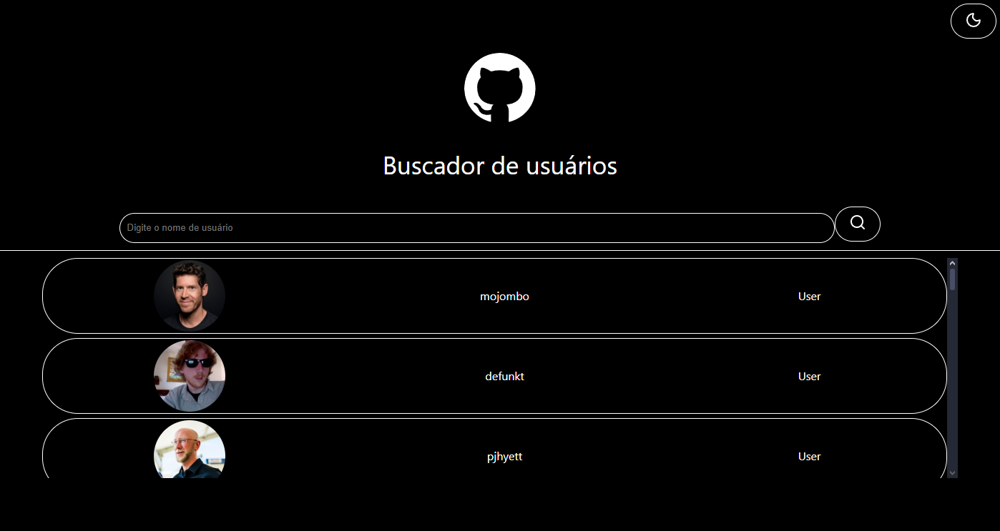
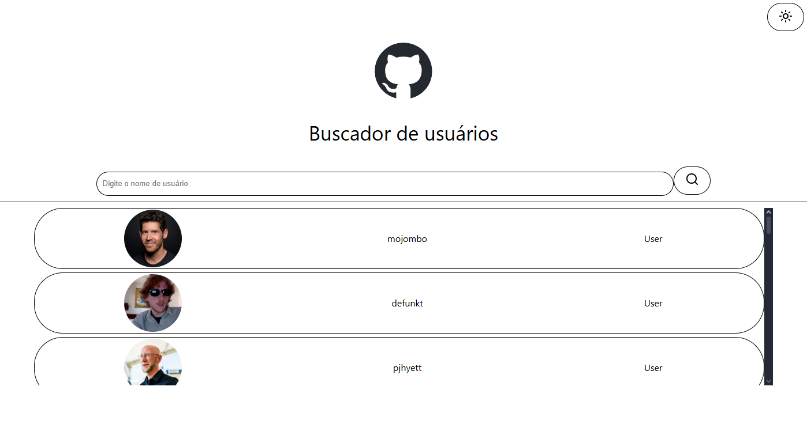
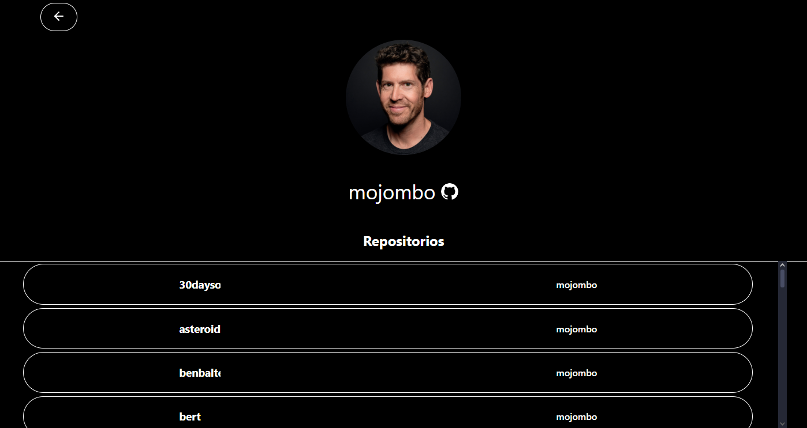
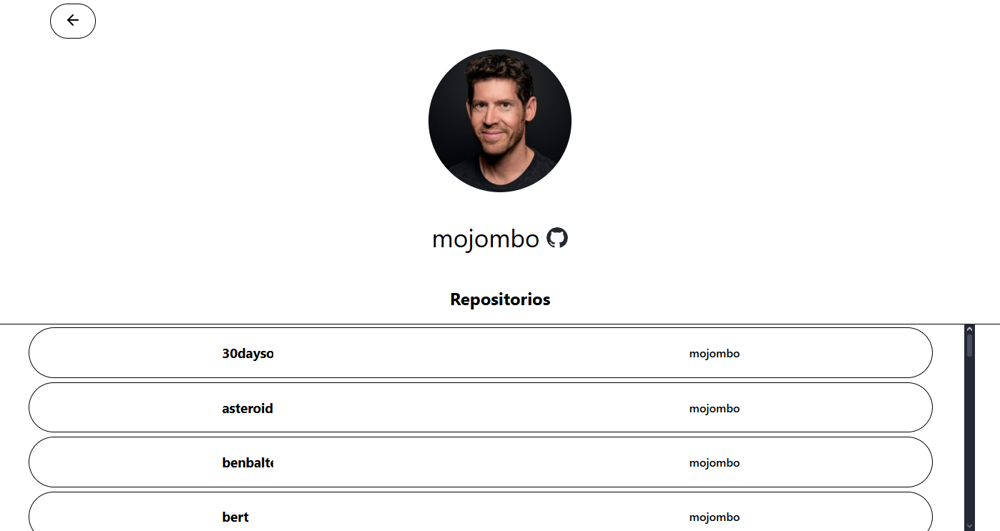

# Buscador de usuários

[](https://nodejs.org/)  [](https://vitejs.dev/)  [](https://www.typescriptlang.org/)  [](https://github.com/Daniel13s/buscador-de-usuarios/blob/main/LICENSE)

O Buscador de usuários é uma ferramenta que utiliza de uma API publica, e oficial do GitHub. Ela foi desenvolvida para praticar a integração de API's em meus projetos.

---

## ✨ Funcionalidades
- **Buscar usuários** → Você pode buscar pelo nome, qualquer usuário disponível na API
	
- **Trocar tema** → Clicando no ícone de sol ou lua, pode alterar entre tem *light* e *dark*
	
- **Ver repositórios** → Clicando em cima do usuário, será redirecionado para outra página, com os repositórios do mesmo.


---

## 🛠️ Tecnologias Utilizadas
- React com Vite
	
- TypeScript
	
- Redux
	
- Lucide-React
	
- MSW(Mock Service Worker)
	
- Axios


---

## ▶️ Como Rodar o Projeto

### 🔧 Pré-requisitos

- [Node.js](https://nodejs.org/) v16+
    
- [npm](https://www.npmjs.com/) ou [yarn](https://yarnpkg.com/)
    

### 🚀 Passos

```bash
# Clonar o repositório
git clone https://github.com/Daniel13s/TickIt.git
cd TickIt

# Instalar dependências
npm install
# ou
yarn install

# Rodar aplicação
npm run dev
# ou
yarn dev
```

Após iniciar, acesse no navegador:

```
http://localhost:5173
```

### 📋 Testes

```bash
npm run test
```
---
## 📷Preview

**Home(Dark)**


**Home(Light)**


**Repositórios(Dark)**


**Repositórios(Light)**
